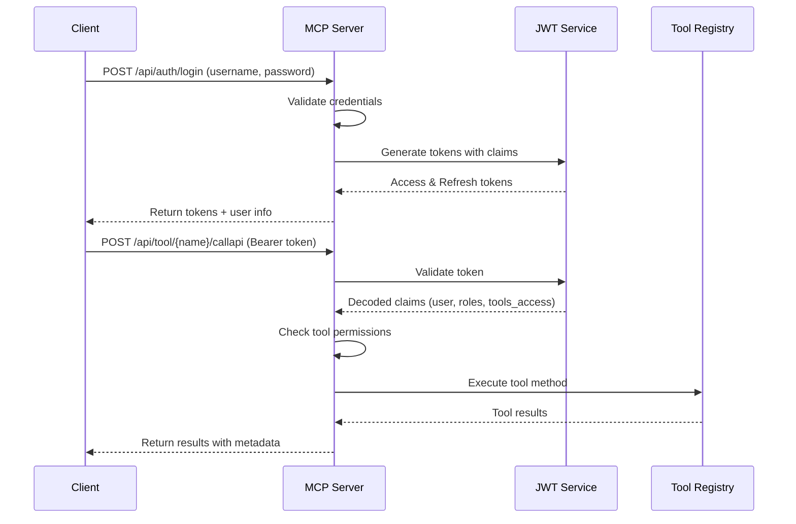

# MCP Server JWT Authentication Documentation

## Table of Contents
1. [Overview](#overview)
2. [How JWT Works in MCP Server](#how-jwt-works)
3. [User Guide](#user-guide)
4. [API Reference](#api-reference)
5. [Configuration Guide](#configuration-guide)
6. [Security Architecture](#security-architecture)
7. [Troubleshooting](#troubleshooting)
8. [Best Practices](#best-practices)

---

## Overview

The MCP Server implements a dual authentication system:
- **Session-based authentication**: For web interface and traditional endpoints
- **JWT-based authentication**: For stateless API access to MCP tools

### Key Features
- 🔐 Secure token-based authentication
- 👥 Role-based access control (RBAC)
- 🛠️ Tool-level permission management
- ⏱️ Automatic token refresh mechanism
- 📊 Per-user rate limiting
- 📝 Comprehensive audit logging

---

## How JWT Works in MCP Server

### 1. Authentication Flow



### 2. Token Structure

#### Access Token Claims
```json
{
  "sub": "user1",                    // Subject (username)
  "iat": 1699123456,                 // Issued at
  "exp": 1699127056,                 // Expiration (1 hour)
  "fresh": false,                    // Fresh token flag
  "type": "access",                  // Token type
  "full_name": "John Doe",           // User's full name
  "roles": ["user"],                 // User roles
  "tools_access": [                  // Allowed tools
    "wikipedia",
    "google_search",
    "yahoo_finance"
  ]
}
```

#### Refresh Token Claims
```json
{
  "sub": "user1",                    // Subject (username)
  "iat": 1699123456,                 // Issued at
  "exp": 1699728256,                 // Expiration (7 days)
  "type": "refresh",                 // Token type
  "full_name": "John Doe",           // User's full name
  "roles": ["user"]                  // User roles
}
```

### 3. Permission Model

```yaml
Permission Hierarchy:
  Admin Role:
    - Access: All tools (wildcard "*")
    - Override: Can bypass all restrictions
    
  User Permissions:
    - Explicit tool list in tools_access
    - No access to unlisted tools
    - Cannot override restrictions
    
  Permission Check Order:
    1. Check if user has admin role
    2. Check if tools_access contains "*"
    3. Check if specific tool in tools_access
    4. Deny access if none match
```

---

## User Guide

### For End Users

#### 1. Getting Started

##### First-Time Login
```python
import requests

# Login to get tokens
response = requests.post(
    "http://localhost:5000/api/auth/login",
    json={
        "username": "your_username",
        "password": "your_password"
    }
)

if response.status_code == 200:
    tokens = response.json()
    access_token = tokens["access_token"]
    refresh_token = tokens["refresh_token"]
```

##### Using the Access Token
```python
# Call a tool with authentication
headers = {
    "Authorization": f"Bearer {access_token}",
    "Content-Type": "application/json"
}

response = requests.post(
    "http://localhost:5000/api/tool/wikipedia/callapi",
    headers=headers,
    json={
        "method": "search_articles",
        "arguments": {
            "query": "Machine Learning",
            "limit": 10
        }
    }
)
```

#### 2. Common Operations

##### Check Your Permissions
```python
# Verify token and see your access
response = requests.get(
    "http://localhost:5000/api/auth/verify",
    headers={"Authorization": f"Bearer {access_token}"}
)

user_info = response.json()
print(f"Your tools: {user_info['tools_access']}")
```

##### Refresh Expired Token
```python
# When access token expires (after 1 hour)
response = requests.post(
    "http://localhost:5000/api/auth/refresh",
    headers={"Authorization": f"Bearer {refresh_token}"}
)

new_access_token = response.json()["access_token"]
```

### For Administrators

#### Managing User Access

##### 1. Add New User with Tool Access
```json
// In users.json
{
  "id": "new_user",
  "password": "secure_password",
  "full_name": "New User",
  "roles": ["user"],
  "tools_access": [
    "wikipedia",
    "google_search",
    "sql"
  ]
}
```

##### 2. Grant Admin Access
```json
{
  "id": "power_user",
  "password": "secure_password",
  "full_name": "Power User",
  "roles": ["admin", "user"],
  "tools_access": ["*"]  // Wildcard for all tools
}
```

##### 3. Create Department-Specific Access
```json
// Finance Department User
{
  "id": "finance_user",
  "password": "secure_password",
  "full_name": "Finance Analyst",
  "roles": ["user", "finance"],
  "tools_access": [
    "yahoo_finance",
    "fed_reserve",
    "ecb",
    "bank_of_england",
    "sec",
    "edgar",
    "duckdb_olap",
    "msoffice"
  ]
}

// Research Department User
{
  "id": "researcher",
  "password": "secure_password",
  "full_name": "Research Analyst",
  "roles": ["user", "research"],
  "tools_access": [
    "wikipedia",
    "google_search",
    "tavily",
    "census",
    "sql"
  ]
}
```

---

## API Reference

### Authentication Endpoints

#### POST `/api/auth/login`
Authenticate user and receive JWT tokens.

**Request:**
```json
{
  "username": "string",
  "password": "string"
}
```

**Response (200 OK):**
```json
{
  "access_token": "eyJhbGciOiJIUzI1NiIs...",
  "refresh_token": "eyJhbGciOiJIUzI1NiIs...",
  "user": {
    "username": "user1",
    "full_name": "John Doe",
    "roles": ["user"]
  }
}
```

**Error Responses:**
- `401 Unauthorized`: Invalid credentials
- `400 Bad Request`: Missing username or password

---

#### POST `/api/auth/refresh`
Refresh access token using refresh token.

**Headers:**
```
Authorization: Bearer <refresh_token>
```

**Response (200 OK):**
```json
{
  "access_token": "eyJhbGciOiJIUzI1NiIs..."
}
```

**Error Responses:**
- `401 Unauthorized`: Invalid or expired refresh token

---

#### GET `/api/auth/verify`
Verify token and retrieve user information.

**Headers:**
```
Authorization: Bearer <access_token>
```

**Response (200 OK):**
```json
{
  "username": "user1",
  "full_name": "John Doe",
  "roles": ["user"],
  "tools_access": ["wikipedia", "google_search", "yahoo_finance"]
}
```

---

### Tool API Endpoint

#### POST `/api/tool/{tool_name}/callapi`
Execute tool method with JWT authentication.

**Headers:**
```
Authorization: Bearer <access_token>
Content-Type: application/json
```

**Request:**
```json
{
  "method": "method_name",
  "arguments": {
    "param1": "value1",
    "param2": "value2"
  }
}
```

**Response (200 OK):**
```json
{
  "result": "...",
  "_meta": {
    "user": "user1",
    "timestamp": "2024-11-10T10:30:00",
    "tool": "wikipedia",
    "method": "search_articles"
  }
}
```

**Error Responses:**
- `401 Unauthorized`: Missing or invalid token
- `403 Forbidden`: User lacks permission for this tool
- `429 Too Many Requests`: Rate limit exceeded
- `500 Internal Server Error`: Tool execution error

---

## Configuration Guide

### 1. Environment Variables

Create a `.env` file in your project root:

```bash
# JWT Configuration
JWT_SECRET_KEY=your-very-long-random-secret-key-minimum-32-chars
JWT_ACCESS_TOKEN_EXPIRES=3600        # 1 hour in seconds
JWT_REFRESH_TOKEN_EXPIRES=604800     # 7 days in seconds
JWT_ALGORITHM=HS256

# Flask Configuration
FLASK_SECRET_KEY=another-random-secret-key
FLASK_ENV=production

# Rate Limiting
RATE_LIMIT_PER_USER=100              # Max calls per minute
RATE_LIMIT_WINDOW=60                 # Window in seconds
```

### 2. User Configuration

Edit `config/users.json`:

```json
{
  "users": [
    {
      "id": "username",
      "password": "hashed_password",
      "full_name": "Display Name",
      "roles": ["role1", "role2"],
      "tools_access": ["tool1", "tool2", "*"]
    }
  ]
}
```

### 3. Tool Permissions Matrix

| User Type | Roles | Tools Access | Description |
|-----------|-------|--------------|-------------|
| Admin | `["admin", "user"]` | `["*"]` | Full access to all tools |
| Power User | `["user", "analyst"]` | Specific list | Access to assigned tools |
| Limited User | `["user"]` | Minimal list | Basic tool access |
| Guest | `["guest"]` | `["wikipedia"]` | Read-only public tools |

---

## Security Architecture

### 1. Token Lifecycle

```
Token Generation → Transmission → Validation → Refresh → Expiration
      ↓               ↓              ↓            ↓           ↓
   Signed HS256    HTTPS Only    Signature    New Token   Automatic
                                  Verified     Generated    Cleanup
```

### 2. Security Layers

```
┌─────────────────────────────────────┐
│         HTTPS/TLS Layer             │
├─────────────────────────────────────┤
│     JWT Token Validation            │
├─────────────────────────────────────┤
│    Role-Based Access Control        │
├─────────────────────────────────────┤
│     Tool-Level Permissions          │
├─────────────────────────────────────┤
│      Rate Limiting per User         │
├─────────────────────────────────────┤
│        Audit Logging                │
└─────────────────────────────────────┘
```

### 3. Attack Prevention

| Attack Type | Prevention Measure |
|-------------|-------------------|
| Brute Force | Rate limiting, account lockout |
| Token Theft | Short expiration, HTTPS only |
| Replay Attack | Token expiration, nonce validation |
| Privilege Escalation | Strict permission checking |
| SQL Injection | Parameterized queries in SQL tools |
| XSS | Input sanitization, CSP headers |

---

## Troubleshooting

### Common Issues and Solutions

#### 1. "Token has expired"
**Problem:** Access token expired after 1 hour
**Solution:**
```python
# Use refresh token to get new access token
response = requests.post(
    "http://localhost:5000/api/auth/refresh",
    headers={"Authorization": f"Bearer {refresh_token}"}
)
new_access_token = response.json()["access_token"]
```

#### 2. "Access denied to tool"
**Problem:** User lacks permission for requested tool
**Solution:**
- Check user's `tools_access` list in users.json
- Add tool to user's access list or grant admin role
- Verify using `/api/auth/verify` endpoint

#### 3. "Invalid token"
**Problem:** Malformed or corrupted token
**Solution:**
- Ensure token is properly formatted: `Bearer <token>`
- Check for token truncation in storage
- Re-authenticate to get new tokens

#### 4. "Rate limit exceeded"
**Problem:** Too many requests in time window
**Solution:**
```python
import time

def call_with_retry(func, *args, **kwargs):
    max_retries = 3
    for i in range(max_retries):
        response = func(*args, **kwargs)
        if response.status_code != 429:
            return response
        
        retry_after = response.json().get('retry_after', 60)
        time.sleep(retry_after)
    
    return response
```

#### 5. "Missing or invalid authorization header"
**Problem:** Token not included in request
**Solution:**
```python
# Correct header format
headers = {
    "Authorization": f"Bearer {access_token}",  # Note the space after Bearer
    "Content-Type": "application/json"
}
```

### Debug Mode

Enable debug logging for JWT issues:

```python
# In mcp_app.py
import logging

logging.basicConfig(level=logging.DEBUG)
jwt_logger = logging.getLogger('flask_jwt_extended')
jwt_logger.setLevel(logging.DEBUG)

@app.before_request
def log_request_info():
    app.logger.debug('Headers: %s', request.headers)
    app.logger.debug('Body: %s', request.get_data())
```

---

## Best Practices

### 1. Token Storage (Client-Side)

```javascript
// JavaScript - Secure Storage
class TokenManager {
    constructor() {
        this.accessToken = null;  // Store in memory only
        this.refreshToken = null;  // Consider httpOnly cookie
    }
    
    setTokens(access, refresh) {
        this.accessToken = access;
        // For refresh token, use secure cookie or encrypted storage
        this.setSecureRefreshToken(refresh);
    }
    
    setSecureRefreshToken(token) {
        // Option 1: Request backend to set httpOnly cookie
        // Option 2: Use encrypted sessionStorage
        // Never use plain localStorage
    }
}
```

### 2. Automatic Token Refresh

```python
class APIClient:
    def __init__(self, base_url, username, password):
        self.base_url = base_url
        self.username = username
        self.password = password
        self.access_token = None
        self.refresh_token = None
        self.token_expiry = None
        
    def ensure_authenticated(self):
        """Ensure we have a valid access token"""
        if not self.access_token or self.is_token_expired():
            if self.refresh_token:
                self.refresh_access_token()
            else:
                self.login()
    
    def is_token_expired(self):
        """Check if token is expired or about to expire"""
        if not self.token_expiry:
            return True
        # Refresh 5 minutes before expiry
        buffer_time = 300
        return time.time() > (self.token_expiry - buffer_time)
    
    def call_tool(self, tool_name, method, arguments):
        """Call tool with automatic token management"""
        self.ensure_authenticated()
        
        response = requests.post(
            f"{self.base_url}/api/tool/{tool_name}/callapi",
            headers={"Authorization": f"Bearer {self.access_token}"},
            json={"method": method, "arguments": arguments}
        )
        
        if response.status_code == 401:
            # Token might have expired, try refreshing
            self.refresh_access_token()
            # Retry the request
            response = requests.post(
                f"{self.base_url}/api/tool/{tool_name}/callapi",
                headers={"Authorization": f"Bearer {self.access_token}"},
                json={"method": method, "arguments": arguments}
            )
        
        return response
```

### 3. Monitoring and Logging

```python
# Add to mcp_app.py for comprehensive logging
import json
from datetime import datetime

def log_jwt_access(username, tool, method, success, error=None):
    """Log all JWT API access for audit"""
    log_entry = {
        "timestamp": datetime.utcnow().isoformat(),
        "username": username,
        "tool": tool,
        "method": method,
        "success": success,
        "error": error,
        "ip_address": request.remote_addr,
        "user_agent": request.headers.get('User-Agent')
    }
    
    # Write to audit log file
    with open('jwt_audit.log', 'a') as f:
        f.write(json.dumps(log_entry) + '\n')
    
    # Also send to monitoring service if configured
    if app.config.get('MONITORING_ENABLED'):
        send_to_monitoring(log_entry)
```

### 4. Production Deployment Checklist

- [ ] Use strong JWT secret keys (minimum 256 bits)
- [ ] Enable HTTPS for all endpoints
- [ ] Implement rate limiting per user
- [ ] Set appropriate token expiration times
- [ ] Enable comprehensive audit logging
- [ ] Implement token refresh mechanism
- [ ] Use secure password hashing (bcrypt/argon2)
- [ ] Configure CORS properly
- [ ] Add security headers (CSP, HSTS, etc.)
- [ ] Implement account lockout after failed attempts
- [ ] Regular security audits and updates
- [ ] Monitor for suspicious activity
- [ ] Implement token revocation mechanism
- [ ] Document API security requirements
- [ ] Test all authentication scenarios

---

## Appendix: Quick Reference

### cURL Commands

```bash
# Login
curl -X POST http://localhost:5000/api/auth/login \
  -H "Content-Type: application/json" \
  -d '{"username":"user1","password":"user123"}'

# Call Tool
curl -X POST http://localhost:5000/api/tool/wikipedia/callapi \
  -H "Authorization: Bearer YOUR_ACCESS_TOKEN" \
  -H "Content-Type: application/json" \
  -d '{"method":"search_articles","arguments":{"query":"Python"}}'

# Refresh Token
curl -X POST http://localhost:5000/api/auth/refresh \
  -H "Authorization: Bearer YOUR_REFRESH_TOKEN"

# Verify Token
curl -X GET http://localhost:5000/api/auth/verify \
  -H "Authorization: Bearer YOUR_ACCESS_TOKEN"
```

### Python Client Library

```python
from mcp_jwt_client import MCPClient

# Initialize client
client = MCPClient("http://localhost:5000")

# Login
client.login("user1", "user123")

# Call tool
result = client.call_tool(
    "wikipedia",
    "search_articles",
    {"query": "Machine Learning"}
)

# Auto-refresh happens internally
print(result)
```

---

*Last Updated: November 2024*
*Version: 1.0.0*